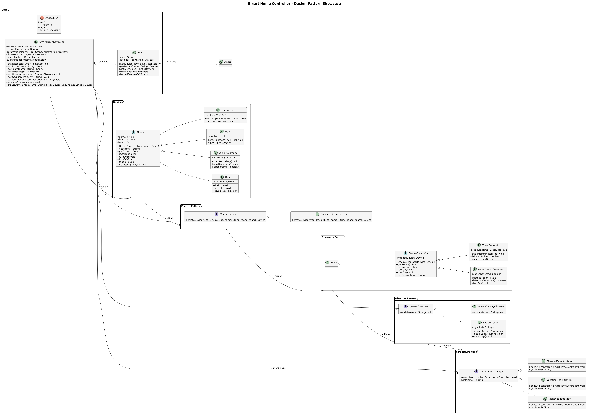

# Smart Home Controller

A Java-based application that simulates controlling various smart home devices, demonstrating the use of multiple design patterns.

## Overview

This project implements a Smart Home Controller system that allows users to control various smart home devices like lights, thermostats, doors, and security cameras. The system organizes devices by rooms and supports automation modes like Night Mode and Vacation Mode.

The main goal of this project is to showcase the implementation of multiple design patterns in a practical application.

## Features

- Control smart devices (lights, thermostats, doors, security cameras)
- Group devices by room for organized management
- Turn devices on/off individually or by room
- Adjust device-specific settings (brightness, temperature, etc.)
- System logging of all actions
- Automation modes for common scenarios
- Extensible architecture using design patterns

## Design Patterns

This project demonstrates the implementation of five key design patterns:

1. **Singleton Pattern**  
   Ensures only one instance of the central controller exists.

2. **Factory Pattern**  
   Creates different types of devices dynamically without exposing creation logic.

3. **Observer Pattern**  
   Notifies system components when device states change.

4. **Decorator Pattern**  
   Adds features to devices at runtime (like motion detection or timers).

5. **Strategy Pattern**  
   Implements different automation modes that can be switched dynamically.

## Project Structure

```
IndividualProjectSourceCode/

├── core/
│   ├── DeviceType.java
│   ├── Room.java
│   └── SmartHomeController.java
├── devices/
│   ├── Device.java
│   ├── Light.java
│   ├── Thermostat.java
│   ├── Door.java
│   └── SecurityCamera.java
├── factory/
│   ├── DeviceFactory.java
│   └── ConcreteDeviceFactory.java
├── observer/
│   ├── SystemObserver.java
│   ├── SystemLogger.java
│   └── ConsoleDisplayObserver.java
├── decorator/
│   ├── DeviceDecorator.java
│   ├── MotionSensorDecorator.java
│   └── TimerDecorator.java
├── strategy/
│   ├── AutomationStrategy.java
│   ├── NightModeStrategy.java
│   ├── MorningModeStrategy.java
│   └── VacationModeStrategy.java
├── ui/
│   └── CommandLineInterface.java
└── main/
    └── Main.java
├── docs/
│   ├── diagrams/
│   │   └── class-diagram.png
│   └── Design Patterns Report.md
└── README.md
```

## Getting Started

### Prerequisites

- Java Development Kit (JDK) 11 or higher
- Any Java IDE the supports packages(IntelliJ IDEA,Eclipse,etc.) or command-line tools

### Installation

1. Clone the repository:

   ```bash
   git clone git@github.com:DAN6256/SWE-IndividualProject.git
   ```

2. Open the project in your preferred IDE or build using command-line tools.

### Running the Application

You can run the application in two ways:

1. **Using the Command Line Interface**:

   ```bash
   javac ui/CommandLineInterface.java
   java ui/CommandLineInterface.java
   ```

   This starts an interactive console that lets you control the smart home system.

2. **Using the Main Demo**:
   ```bash
   java main.Main
   ```
   This runs a demonstration of the system features.

## Usage Examples

### Creating a Smart Home Controller

```java
// Get the singleton instance
SmartHomeController controller = SmartHomeController.getInstance();

// Add a room
Room livingRoom = controller.addRoom("Living Room");

// Create a device
Device light = controller.createDevice("Living Room", DeviceType.LIGHT, "Main Light");

// Turn on the light
light.turnOn();
```

### Adding Observers

```java
// Create a logger
SystemLogger logger = new SystemLogger();

// Register the logger with the controller
controller.addObserver(logger);

// Now all system events will be logged
```

### Using Decorators

```java
// Create a basic light
Device light = controller.createDevice("Kitchen", DeviceType.LIGHT, "Ceiling Light");

// Add motion sensing capability
Device motionLight = new MotionSensorDecorator(light);

// Add timer capability to the motion-sensing light
Device smartLight = new TimerDecorator(motionLight);

// Now we can use enhanced features
((MotionSensorDecorator)((TimerDecorator)smartLight).getWrappedDevice()).detectMotion();
((TimerDecorator)smartLight).setTimer(5); // Turn off after 5 minutes
```

### Using Automation Modes

```java
// Register automation strategies
controller.registerAutomationMode("night", new NightModeStrategy());
controller.registerAutomationMode("morning", new MorningModeStrategy());

// Set and execute an automation mode
controller.setAutomationMode("night");
controller.executeCurrentMode();
```

## UML Class Diagram (Zoom to see)



## License

This project currently has no license

## Acknowledgments

- This project was developed as part of the CS 415: Software Engineering course
- Inspired by real-world IoT and smart home systems
- Design patterns based on the "Gang of Four" patterns

## Author

Daniel Tunyinko
